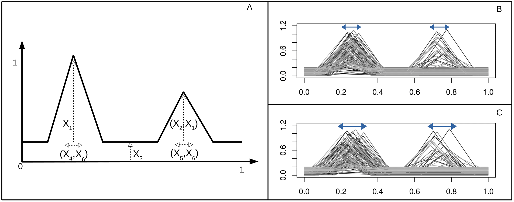

```{r Define parameters, include=FALSE}
knitr::opts_chunk$set(echo = TRUE)
n <- params$n
X6<- params$X6
np <- params$np
nbClust <- params$nbClust
```

# Introduction

This document provides the code of the Cluster-Based GSA method applied on the ToyCurves model as presented in (Roux, Buis et al., submitted to ENVIRON. MODELL. SOFTW.)

Main parameters can be changed using the Rstudio "Knit with parameters ..." menu Bar:

* n: the sample size for the Sensitivity Analysis Design-Of-Experiment (decreasing it may dramatically lower the computation time but may increase uncertainty of sensitivity indices)
* X6: ToyCurves parameter that controls the magnitude of the shift of the two triangles (0.05 corresponds to setting 1 in Roux, Buis et al., and 0.08 to setting 2)
* np: the number of points on which the curves are discretized
* nbClust: the number of clusters


# Install and load useful packages

```{r Install and load packages, message=FALSE, warning=FALSE}
if(!require("knitr")){
  install.packages("knitr")
  library("knitr")
}
if(!require("sensitivity")){
  install.packages("sensitivity")
  library("sensitivity")
}
if(!require("lhs")){
  install.packages("lhs")
  library("lhs")
}
if(!require("fclust")){
  install.packages("fclust")
  library("fclust")
}

```

# ToyCurves model

The ToyCurves model has six parameters and produces a curve, on the [0,1] interval, defined as a sum of a vertical offset plus two shifted triangles. As can be seen on Fig. 1, parameter X_1 drives the height of the first triangle while two parameters (X_1,X_2) drive the height of the second one in an interacting way. Their abscissas are centered respectively at t=0.15 and t=0.75 with perturbations controlled by parameters (X_4,X_6) for Triangle 1 and (X_5,X_6) for Triangle 2. Parameter X_3 controls the height of the global shift. 


```{r, echo = FALSE, message=FALSE, fig.align='center', fig.pos="H", fig.cap='Figure 1. The  ToyCurves  model  (A)  and  some  samples  for  two  parameter  settings;  Setting  1:small t-shift (B), Setting 2:  large t-shift (C).'}

```


```{r Toycurve model}
# Triangle function
trg <- function(x,y,w,np=100)
  # x: position of the triangle's peak on the x-axis
  # y: position of the triangle's peak on the y-axis
  # w: factor that controls the width of the triangle 
  # np: number of points on which the triangle is mapped along the x-axis 
{
  t = seq(0,1,length.out=np)
  res = y*(1-pmin(1,abs(t-x)/w))
  return(res)
}

# ToyCurves
ToyCurves <- function(X1, X2, X3, X4, X5, X6, np=100)
  # X1: position of the first triangle's peak on the y-axis  
  # X2: position of the second triangle's peak on the y-axis  
  # X3: height of the global shift  
  # X4: controls horizontal shift of the first triangle  
  # X5: controls horizontal shift of the second triangle   
  # X6: multiplicative factor applied on the shift of both first and second triangles  
{
	res = seq(0,1,length.out=np)
	return( rep(0,np)+X3/5.0+ trg(0.25+(2*(X4-0.5))*X6,X1,0.15,np)+(X2>0.5)*(X1>0.5)*trg(0.75+(2*(X5-0.5))*X6,2*(X2-0.5),0.15,np) )
}
```

# Plot function

Just a simple function to plot indices with error bars (created for GSI indices since no plot function exists for this one ... but we also use it here for all other indices for sake of homogeneity).

```{r Plot function}
plot_indices <- function(Si1, ST, lowCI_Si1, upCI_Si1, lowCI_ST, upCI_ST, graph_title="") {
  # Si1: vector of main Sobol' indices for each parameter
  # ST: vector of total Sobol' indices for each parameter
  # lowCI_Si1: vector of confidence interval lower bounds for main Sobol' indices for each parameter
  # upCI_Si1: vector of confidence interval upper bounds for main Sobol' indices for each parameter
  # lowCI_ST: vector of confidence interval lower bounds for total Sobol' indices for each parameter
  # upCI_ST: vector of confidence interval upper bounds for total Sobol' indices for each parameter
  b <-  barplot(rbind(ST,Si1), 
                beside=TRUE, ylim=c(0,1), col=c(gray(0.5),'white'), 
                names.arg=paramNames, main=graph_title, 
                legend.text=c("TSI",expression(SI[1])))
  
  # plot confidence intervals
  for (i in 1:nbParam)
  {
    segments(b[2*i-1],lowCI_ST[i],b[2*i-1],upCI_ST[i])
    segments(b[2*i],lowCI_Si1[i],b[2*i],upCI_Si1[i])
  }
}
```


# Samples generation

```{r Generate Design of Experiment}
set.seed(12345)

# DoE generated using SobolJansen
paramNames <- c('X1','X2','X3','X4','X5')
nbParam <- length(paramNames)
X1 <- randomLHS(n,5); colnames(X1) <- paramNames
X2 <- randomLHS(n,5); colnames(X2) <- paramNames
gsa = soboljansen(model = NULL, X1, X2,  nboot=100, conf = 0.95)

# Run ToyCurves with the ntot parameters' values to obtain ntot simulated curves
ntot <-  dim(gsa$X)[1]
curves <- matrix(nrow=ntot,ncol=np)
for (i in 1:ntot)
{
  curves[i,] <-ToyCurves(X1=gsa$X[i,1], X2=gsa$X[i,2], X3=gsa$X[i,3], X4=gsa$X[i,4],
                    X5=gsa$X[i,5], X6=X6, np=np)
}

# plot (a sub-set of) the generated curves
nc <- 100 # number of curves to plot 
plot(c(0,1),c(0,1.2),typ='n',xlab='',ylab='')
for (i in 1:nc)
{
  lines(seq(0,1,length.out=200),curves[i,],lwd=1,col=grey(i/(1.3*nc)))
}
```

# Curves clustering

Cluster  centers  are  drawn  as  bold  white  curves. Simulated curves are represented with a grey level depending on their membership level to a given cluster (black = high membership, light grey = low membership).

```{r Clustering}
m<-2 # fuzziness parameter
clust <- FKM(curves,k=nbClust,m=m,conv=1e-3, maxit=50)
u <- clust$U # Membership functions
centers <- data.frame(matrix(nrow=nbClust,ncol=np)) # clusters' centers
for (k in 1:nbClust)
  centers[k,]= apply(curves*(u[,k]^m),2,sum) / sum(u[,k]^m)

# plot (a sub-set of) curves for each cluster
nc <- 100 # number of curves to plot 
gr <- 0.0
col_base <- rep(gray(gr),nbClust)
for (cl in 1:nbClust)
{
	plot(c(0,1),c(0,1.2),typ='n',xlab='',main=sprintf("Cluster %d",cl))
	for (i in 1:nc)
		lines(seq(0,1,length.out=200),curves[i,],lwd=2,col= adjustcolor(col_base[cl], alpha.f = u[i,cl]^2))
	lines(seq(0,1,length.out=200),centers[cl,],lty=1,lwd=4,ylim=c(0,1),col='white')
	grid(col='black')
}

```


# Sensitivity indices on membership functions

```{r Clust-SI indices}
Clust_SI <- vector("list",nbClust)
for (cl in 1:nbClust) {
  Clust_SI[[cl]] <- tell(gsa, y=u[,cl])
  plot_indices(Si1=Clust_SI[[cl]]$S[,1], ST=Clust_SI[[cl]]$T[,1], 
               lowCI_Si1=Clust_SI[[cl]]$S[,4], upCI_Si1=Clust_SI[[cl]]$S[,5], 
               lowCI_ST=Clust_SI[[cl]]$T[,4], upCI_ST=Clust_SI[[cl]]$T[,5], 
               graph_title=paste0("Cluster",cl))
}
```


# Sensitivity  indices on the difference between two membership functions 

```{r dClust-SI indices}
comb <- combn(nbClust,2) # computes the different combinations of 2 clusters among nbClust
nbComb <- ncol(comb)

for (icomb in 1:nbComb) {
  dClust_SI <- tell(gsa, y=u[,comb[1,icomb]]-u[,comb[2,icomb]])
  plot_indices(Si1=dClust_SI$S[,1], ST=dClust_SI$T[,1], 
               lowCI_Si1=dClust_SI$S[,4], upCI_Si1=dClust_SI$S[,5], 
               lowCI_ST=dClust_SI$T[,4], upCI_ST=dClust_SI$T[,5], 
               graph_title=paste0("Direction ",comb[1,icomb],"-",comb[2,icomb]))
}
```


# GSI  on  the  vector  of  membership  functions

```{r Clust-GSI indices}
compute_GSI <- function(V, Si1, ST, paramNames) {
  # Function that computes GSI indices from a set of Sobol' indices computed for multiple variables (e.g. several time-steps of a dynamic output, membership functions for different clusters, ...)
  # V: vector of variances (one value per variable)
  # Si1: data.frame containing the Sobol' main indices per parameter (row) and variable (column)
  # ST: data.frame containing the Sobol' total indices per parameter (row) and variable (column)

  clust_GSI <- list(Si1=setNames(sapply(1:nbParam,function(x) sum(V * Si1[x,]) / sum(V)), paramNames),
                    ST=setNames(sapply(1:nbParam,function(x) sum(V * ST[x,]) / sum(V)), paramNames))
  
}

# Compute Clust-GSI
clust_GSI <- compute_GSI(sapply(Clust_SI, function(x) x$V[1,1]), 
                         sapply(Clust_SI, function(x) x$S[,1]), 
                         sapply(Clust_SI, function(x) x$T[,1]), paramNames)

# Compute confidence intervals on Clust-GSI
nboot=100
clust_GSI_boot <- vector("list",nboot)
for (iboot in 1:nboot)
{
  bt_idx=sample(n,size=n,replace=TRUE) # resample in X1 and X2 matrices
  
  gsa_boot = soboljansen(model = NULL, X1= X1[bt_idx,], X2 = X2[bt_idx,], nboot=0)
  idx_in_orig_DoE = match(data.frame(t(gsa_boot$X)), data.frame(t(gsa$X))) # identify the lines of the bootstrapped DoE, gsa_boot$X, in the original DoE, gsa$X, to reuse the simulated curves
  
  Clust_SI_boot <- vector("list",nbClust)
  for (cl in 1:nbClust)
  {
    Clust_SI_boot[[cl]] <- tell(gsa, y=u[idx_in_orig_DoE,cl])
  }
  clust_GSI_boot[[iboot]] <- compute_GSI(sapply(Clust_SI_boot, function(x) x$V[1,1]), 
                                         sapply(Clust_SI_boot, function(x) x$S[,1]), 
                                         sapply(Clust_SI_boot, function(x) x$T[,1]), paramNames)
  
}

# Quantiles computation
clust_GSI$Si1_CI95pcMin <- setNames(rep(NA,nbParam), paramNames); clust_GSI$Si1_CI95pcMax <- setNames(rep(NA,nbParam), paramNames)
clust_GSI$ST_CI95pcMin <- setNames(rep(NA,nbParam), paramNames); clust_GSI$ST_CI95pcMax <- setNames(rep(NA,nbParam), paramNames)
for (i in 1:nbParam)
{
  clust_GSI$Si1_CI95pcMin[i] = quantile(sapply(clust_GSI_boot,`[[`,"Si1")[i,],0.025)
  clust_GSI$Si1_CI95pcMax[i] = quantile(sapply(clust_GSI_boot,`[[`,"Si1")[i,],0.975)
  clust_GSI$ST_CI95pcMin[i] = quantile(sapply(clust_GSI_boot,`[[`,"ST")[i,],0.025)
  clust_GSI$ST_CI95pcMax[i] = quantile(sapply(clust_GSI_boot,`[[`,"ST")[i,],0.975)
  
}

plot_indices(Si1=clust_GSI$Si1, ST=clust_GSI$ST, 
             lowCI_Si1=clust_GSI$Si1_CI95pcMin, upCI_Si1=clust_GSI$Si1_CI95pcMax, 
             lowCI_ST=clust_GSI$ST_CI95pcMin, upCI_ST=clust_GSI$ST_CI95pcMax, 
             graph_title="Cluster-based  GSI")

```


